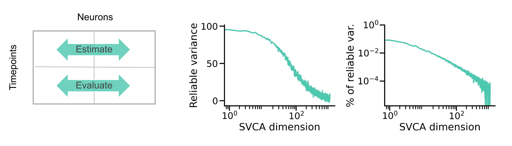

# Shared Variance Component Analysis (SVCA)
Shared Variance Component Analysis (SVCA, [Stringer et al.](https://doi.org/10.1126/science.aav7893)) is a
rigorous and straightforward method to estimate the dimensionality of neural data. This repository contains a
Python-based implementation, with an application to example data (see `docs/`). 



Briefly, SVCA estimates reliable variance using cross-validation along both the observation (time) and feature (neuron) axes. First, the covariance between two (spatially) non-overlapping groups of neurons is computed based on their activity during training time points. A singular value decomposition (SVD) of the covariance is used to compute orthogonal bases for both activity sets. The amount of variance captured by this basis in test samples is defined as reliable. 

Key metrics of a dataset's dimensionality are the number of components required to capture at least, say, 85% of the total reliable variance, and the fraction of reliable variance among those components.

Refer to the original paper for more details:
> Stringer, C., Pachitariu, M., Steinmetz, N., Reddy, C. B., Carandini, M., & Harris, K. D. (2019). Spontaneous behaviors drive
> multidimensional, brainwide activity. Science, 364(6437), eaav7893.

## Installation
Create a Mamba (or Conda) environment with the necessary Python packages:
```
mamba env create --name svca --file environment.yml
```
Install the project package:
```
pip install -e .
```

## Download data
Download an example dataset from the paper:
```
mkdir data/
wget -O data/stringer_spontaneous.npy https://osf.io/dpqaj/download
```

## Usage
First, partition your ``activity`` data along the time and neuron axes, for example using the function from `src/svca`.
The appropriate choice of partitioning parameters (e.g., `bin_width`) will depend on your data. In this example, neurons are indexed by a one-dimensional spatial `position`:
```
from src import svca
Ftrain, Ftest, Gtrain, Gtest = svca.split_data(activity, position)
```
Next, run SVCA:
```
shared_variance, all_variance, SVC1, SVC2 = svca.svca(Ftrain, Ftest, Gtrain, Gtest)
```
This function returns the variance shared between the neuron groups, the variance within the groups, and the projections of each group's activity onto its SVCA basis. 

## Acknowledgements
Thanks to Carsen Stringer and colleagues for sharing their data (see [Figshare](https://doi.org/10.25378/janelia.6163622.v6)).
